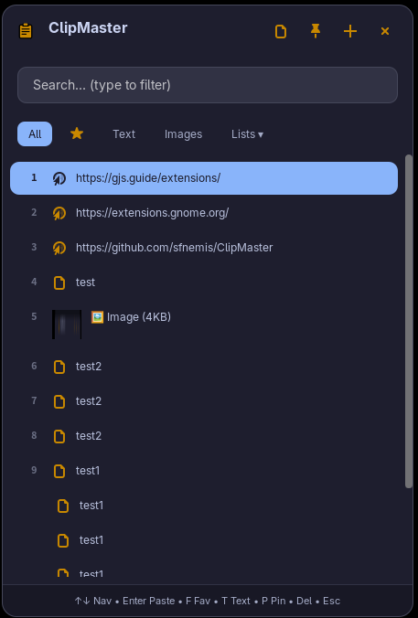
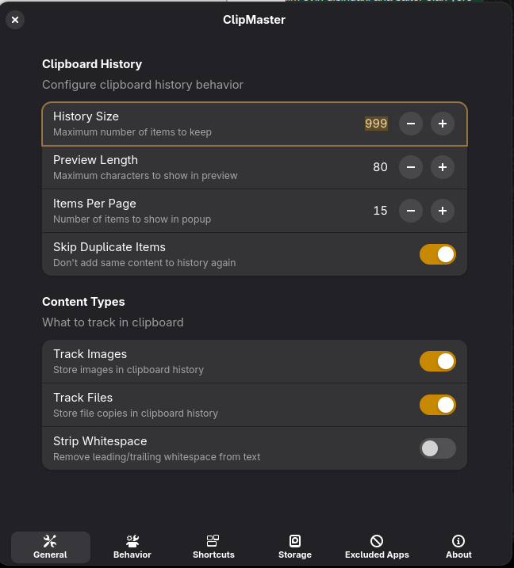
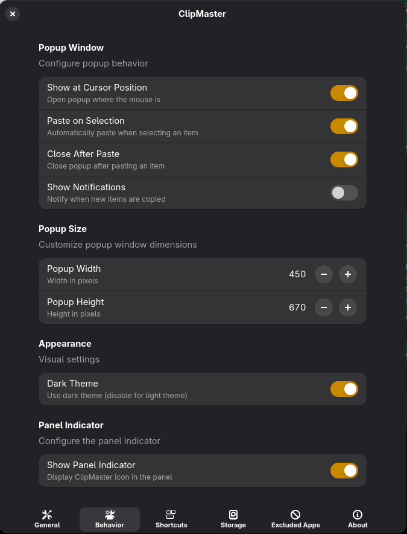
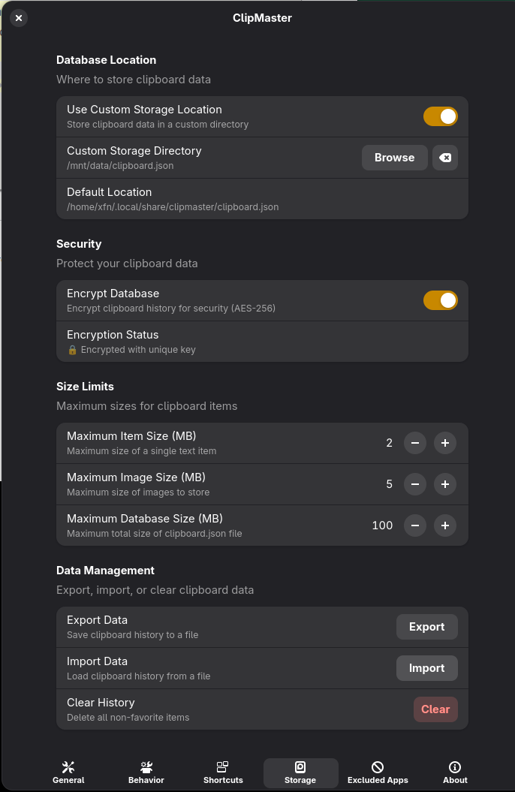
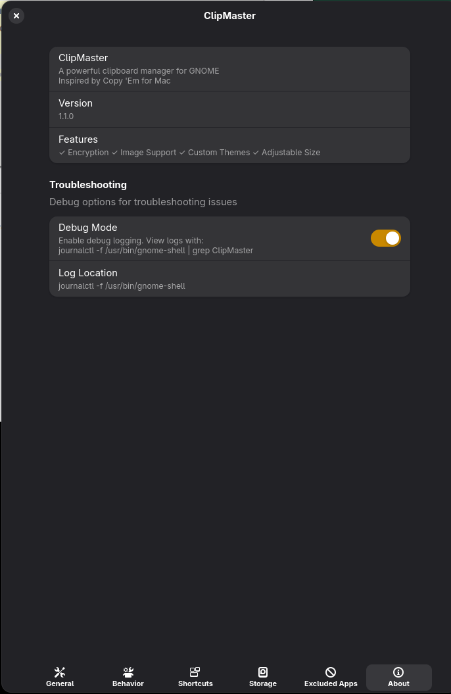

<p align="center">
  
</p>

<h1 align="center">ClipMaster</h1>

<p align="center">
  <strong>A powerful, modern clipboard manager for GNOME Shell 45+</strong>
</p>

<p align="center">
  <a href="#-features">Features</a> •
  <a href="#-themes">Themes</a> •
  <a href="#-installation">Installation</a> •
  <a href="#-usage">Usage</a> •
  <a href="#️-keyboard-shortcuts">Shortcuts</a> •
  <a href="#️-configuration">Configuration</a> •
  <a href="#️-screenshots">Screenshots</a>
</p>

<p align="center">
  
  
  
  
</p>

<p align="center">
  
</p>

---

## ✨ Features

### 📋 Clipboard History & Management
- **Unlimited History** - Keep track of everything you copy with configurable history size (up to 5000 items)
- **Multi-Format Support** - Full support for text, HTML, images, files, URLs, and colors
- **Smart Search** - Real-time search through your entire clipboard history
- **Quick Paste** - Press `1-9` to instantly paste recent items without opening the popup
- **Image Support** - Capture and manage images from clipboard (Wayland & X11)
- **File Tracking** - Track file copies and manage file clipboard entries
- **Primary Selection** - Optionally track PRIMARY selection (middle mouse button paste)

### 🎨 Beautiful UI & 12 Stunning Themes
- **12 Built-in Themes** - Choose from 12 professionally designed themes:
  - 🎨 **Gruvbox** (Default) - Retro groove color scheme
  - 🦇 **Dracula** - Dark theme with vibrant accents
  - ❄️ **Nord** - Arctic, north-bluish color palette
  - 🍑 **Catppuccin** - Soothing pastel theme
  - 🌙 **One Dark** - Atom's One Dark theme
  - 🎯 **Adwaita** - GNOME's default theme
  - 🎪 **Monokai** - Classic editor theme
  - ☀️ **Solarized Dark** - Eye-friendly dark theme
  - 🌃 **Tokyo Night** - Clean dark theme inspired by Tokyo
  - 🌹 **Rose Pine** - All natural pine, faux fur and a bit of soho vibes
  - 📦 **Material Dark** - Google Material Design dark theme
  - 🎨 **Ayu** - Clean, elegant theme with great contrast
- **Custom Themes** - Load your own CSS theme files for complete customization
- **Dark & Light Modes** - Automatic theme adaptation or manual selection
- **Draggable Window** - Move the popup anywhere on your screen
- **Pin Functionality** - Keep the popup open while you work
- **Cursor Position** - Popup appears right where your mouse is
- **Responsive Design** - Adjustable popup width and height

### 🔒 Security & Privacy
- **Encrypted Database** - Your clipboard history is encrypted by default using XOR encryption
- **Custom Storage Location** - Choose where to store your clipboard data
- **Skip Duplicates** - Optionally prevent duplicate entries
- **Excluded Applications** - Configure apps to exclude from clipboard tracking
- **Privacy Controls** - Full control over what gets tracked and stored

### ⚡ Performance & Optimization
- **Debounced Saves** - Optimized disk writes for better performance
- **Configurable Limits** - Set maximum item size, image size, and database size
- **Efficient Monitoring** - Low resource usage clipboard monitoring
- **Smart Memory Management** - Automatic cleanup of old items
- **Fast Search** - Instant search results with optimized indexing

### 📁 Organization & Productivity
- **Favorites System** - Star important items for quick access
- **Custom Lists** - Create your own categories to organize clips
- **Filter by Type** - View only text, images, favorites, or all items
- **Edit Items** - Edit titles and content of clipboard items
- **Context Menu** - Right-click for quick actions
- **Item Metadata** - View timestamps, usage count, and item types
- **Plain Text Mode** - Strip formatting when pasting

### ⌨️ Keyboard-First Design
- **Full Keyboard Navigation** - Complete control without touching the mouse
- **Customizable Global Shortcut** - Set your preferred keyboard shortcut (default: `Super+V`)
- **Quick Actions** - Single key presses for common actions
- **Paste as Plain Text** - Customizable shortcut for plain text pasting
- **Accessibility** - Full keyboard support for accessibility

### 🎛️ Advanced Features
- **Panel Indicator** - System tray icon with quick access menu
- **Notifications** - Optional notifications when copying items
- **Auto-paste on Select** - Automatically paste when selecting an item
- **Close on Paste** - Configurable auto-close behavior
- **Preview Length** - Customize how much text is shown in previews
- **Items Per Page** - Adjust how many items are displayed
- **Strip Whitespace** - Automatically clean up copied text
- **Debug Mode** - Enable detailed logging for troubleshooting

---

## 🎨 Themes

ClipMaster comes with **12 beautiful built-in themes** to match your style and workflow. Each theme is carefully crafted with attention to color harmony, contrast, and readability.

### Available Themes

| Theme | Description | Style |
|-------|-------------|-------|
| **Gruvbox** (Default) | Retro groove color scheme with warm, muted tones | Retro |
| **Dracula** | Dark theme with vibrant purple and pink accents | Vibrant |
| **Nord** | Arctic, north-bluish color palette for a calm atmosphere | Arctic |
| **Catppuccin** | Soothing pastel theme with soft colors | Pastel |
| **One Dark** | Popular dark theme from Atom editor | Modern |
| **Adwaita** | GNOME's default theme, perfectly integrated | Native |
| **Monokai** | Classic editor theme with high contrast | Classic |
| **Solarized Dark** | Scientifically designed for eye comfort | Scientific |
| **Tokyo Night** | Clean dark theme inspired by Tokyo's night sky | Minimal |
| **Rose Pine** | All natural pine with soho vibes | Natural |
| **Material Dark** | Google Material Design dark theme | Material |
| **Ayu** | Clean, elegant theme with great contrast | Elegant |

### Custom Themes

You can also load your own CSS theme files for complete customization. Simply point ClipMaster to your custom CSS file in the settings, and your theme will be applied instantly.

**Theme Switching**: Change themes on the fly from the settings panel - no restart required!

---

## 📦 Installation

### Quick Install (Recommended)

```bash
git clone https://github.com/sfnemis/ClipMaster.git
cd ClipMaster
./install.sh
```

### Manual Installation

1. Clone the repository:
```bash
git clone https://github.com/sfnemis/ClipMaster.git
```

2. Copy extension to GNOME extensions directory:
```bash
cp -r ClipMaster/clipmaster@gnome.extension ~/.local/share/gnome-shell/extensions/
```

3. Compile the GSettings schema:
```bash
glib-compile-schemas ~/.local/share/gnome-shell/extensions/clipmaster@gnome.extension/schemas/
```

4. Restart GNOME Shell:
   - **Wayland**: Log out and log back in
   - **X11**: Press `Alt+F2`, type `r`, press Enter

5. Enable the extension:
```bash
gnome-extensions enable clipmaster@gnome.extension
```

### Dependencies

- GNOME Shell 45 or later
- `wl-paste` (for Wayland image support) or `xclip` (for X11)

**Fedora/RHEL:**
```bash
sudo dnf install wl-clipboard xclip
```

**Ubuntu/Debian:**
```bash
sudo apt install wl-clipboard xclip
```

**Arch Linux:**
```bash
sudo pacman -S wl-clipboard xclip
```

---

## 🚀 Usage

### Opening ClipMaster

- **Keyboard shortcut**: Press `Super+V` (default) to open the clipboard popup
- **System tray**: Click the ClipMaster icon in the top panel

### Basic Operations

| Action | How to |
|--------|--------|
| Copy to clipboard | Just copy normally (`Ctrl+C`) - ClipMaster captures it automatically |
| Paste from history | Click an item or press `Enter` on selected item |
| Search | Start typing when popup is open |
| Navigate | Use `↑` `↓` arrow keys |
| Quick paste | Press `1-9` for recent items |
| Add to favorites | Press `F` on selected item or click the star icon |
| Edit item | Right-click on an item and select "Edit Title" or "Edit Content" |
| Delete item | Press `Del` on selected item or right-click and select "Delete" |

### Popup Controls

| Button | Function |
|--------|----------|
| 📌 Pin | Keep popup open when clicking outside |
| 📝 Text | Toggle plain text mode (strips formatting) |
| ➕ Add | Create a new custom list |
| ⭐ Filter | Filter by All, Text, Images, or Favorites |
| ✕ Close | Close the popup |

---

## ⌨️ Keyboard Shortcuts

### Global Shortcuts

| Shortcut | Action |
|----------|--------|
| `Super+V` | Toggle clipboard popup (customizable) |
| `Ctrl+Shift+V` | Paste as plain text (customizable) |

### Popup Shortcuts

| Key | Action |
|-----|--------|
| `↑` `↓` | Navigate through items |
| `Enter` | Paste selected item |
| `1-9` | Quick paste (1st to 9th item) |
| `F` | Toggle favorite on selected item |
| `T` | Toggle plain text mode |
| `P` | Toggle pin (keep popup open) |
| `Del` | Delete selected item |
| `Esc` | Close popup |
| `Tab` | Focus search box |
| `Ctrl+F` | Focus search box |

---

## ⚙️ Configuration

Access settings through:
- **GNOME Extensions app** → ClipMaster → Settings
- **Command**: `gnome-extensions prefs clipmaster@gnome.extension`

### General Settings

| Setting | Description | Default |
|---------|-------------|---------|
| History Size | Maximum number of items to store | 100 |
| Skip Duplicates | Don't add duplicate entries | Enabled |
| Show at Cursor | Open popup at mouse position | Enabled |
| Track Images | Track images in clipboard | Enabled |
| Track Files | Track file copies | Enabled |
| Track Primary Selection | Track PRIMARY selection (middle mouse) | Enabled |
| Strip Whitespace | Strip leading/trailing whitespace | Disabled |
| Paste on Select | Automatically paste when selecting | Enabled |
| Close on Paste | Close popup after pasting | Enabled |
| Show Notifications | Show notification when copying | Disabled |

### Storage Settings

| Setting | Description | Default |
|---------|-------------|---------|
| Max Item Size | Maximum size per text item (MB) | 1 MB |
| Max Image Size | Maximum size per image (MB) | 5 MB |
| Max DB Size | Maximum total database size (MB) | 50 MB |
| Custom Location | Custom storage directory | ~/.local/share/clipmaster |

### Appearance Settings

| Setting | Description | Default |
|---------|-------------|---------|
| Theme | Visual theme (12 built-in themes) | Gruvbox |
| Custom Theme | Path to custom CSS theme file | None |
| Dark Theme | Use dark color scheme | Enabled |
| Popup Width | Width of the popup window | 450px |
| Popup Height | Height of the popup window | 550px |
| Preview Length | Maximum characters in preview | 80 |
| Items Per Page | Number of items to display | 15 |

### Security Settings

| Setting | Description | Default |
|---------|-------------|---------|
| Encrypt Database | Encrypt clipboard history | Enabled |
| Excluded Apps | Applications to exclude from tracking | None |

### Advanced Settings

| Setting | Description | Default |
|---------|-------------|---------|
| Debug Mode | Enable debug logging | Disabled |
| Show Panel Indicator | Show icon in top panel | Enabled |
| Indicator Icon | Icon to show in panel | edit-paste-symbolic |

---

## 🖼️ Screenshots

### Main Popup

<p align="center">
  
</p>

### Settings

<p align="center">
  
</p>

<p align="center">
  
</p>

<p align="center">
  
</p>

<p align="center">
  
</p>

<p align="center">
  
</p>

---

## 🔧 Troubleshooting

### Extension not loading?

1. Check GNOME Shell version compatibility:
```bash
gnome-shell --version
```

2. View extension logs:
```bash
journalctl -f -o cat /usr/bin/gnome-shell 2>&1 | grep -i clipmaster
```

3. Enable debug mode in settings for detailed logging

### Images not being captured?

Make sure you have the required clipboard tools installed:

```bash
# For Wayland
which wl-paste

# For X11
which xclip
```

### Popup not appearing?

1. Check if the extension is enabled:
```bash
gnome-extensions list --enabled | grep clipmaster
```

2. Try changing the keyboard shortcut in settings

3. Check if the popup is appearing off-screen (try disabling "Show at Cursor")

### Theme not applying?

1. Make sure you've selected a theme in settings
2. Try restarting GNOME Shell
3. Check if custom theme path is correct (if using custom theme)

---

## 🤝 Contributing

Contributions are welcome! Feel free to:

1. Fork the repository
2. Create a feature branch (`git checkout -b feature/amazing-feature`)
3. Commit your changes (`git commit -m 'Add amazing feature'`)
4. Push to the branch (`git push origin feature/amazing-feature`)
5. Open a Pull Request

---

## 📄 License

This project is licensed under the **GPL-2.0-or-later** License - see the [LICENSE](clipmaster@gnome.extension/LICENSE) file for details.

---

## 🙏 Acknowledgments

- GNOME Shell team for the amazing extension API
- All contributors and users of ClipMaster
- Theme creators and designers for inspiration

---

<p align="center">
  Made with ❤️ for the GNOME community
</p>

<p align="center">
  <a href="https://github.com/sfnemis/ClipMaster/issues">Report Bug</a> •
  <a href="https://github.com/sfnemis/ClipMaster/issues">Request Feature</a>
</p>
